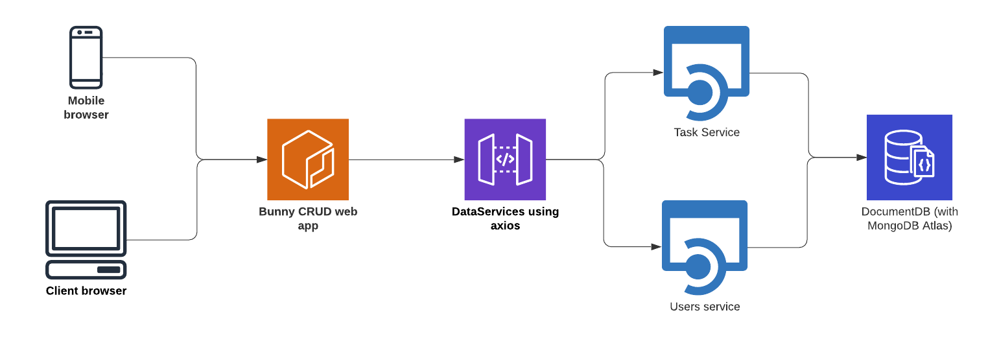

# Bunny CRUD app
This app allows to create users and assign them tasks. Information is stored inside a Mongo Atlas DB therough API REST requests.

## Applicacion running URL
https://app-bunny.herokuapp.com/

## Architecture Diagram

## Notes

* The database contain somre records to make the tests easier.
* Users can be refreshed using the browser reload button. 
* Tasks can be refreshed using the broswer and the UI button.
